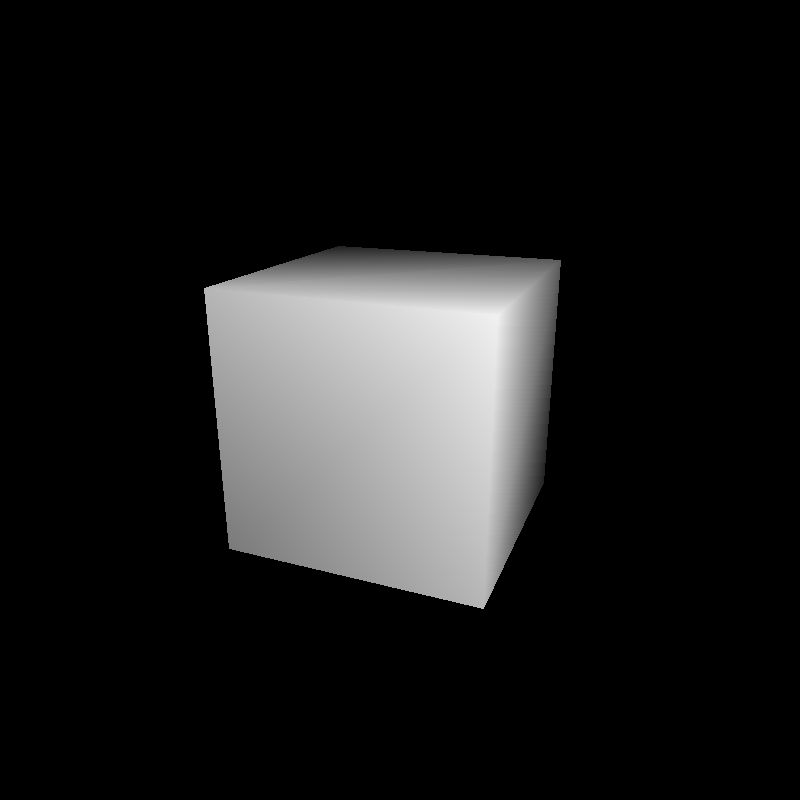
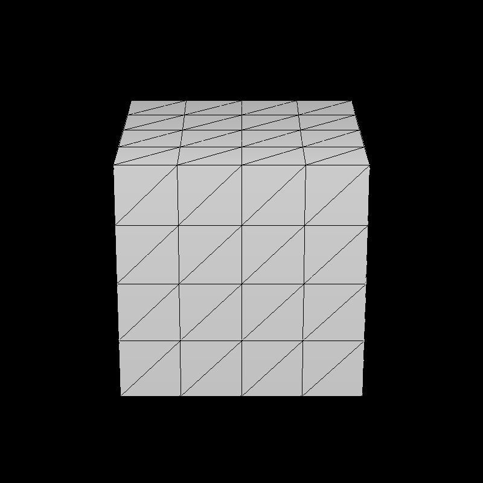
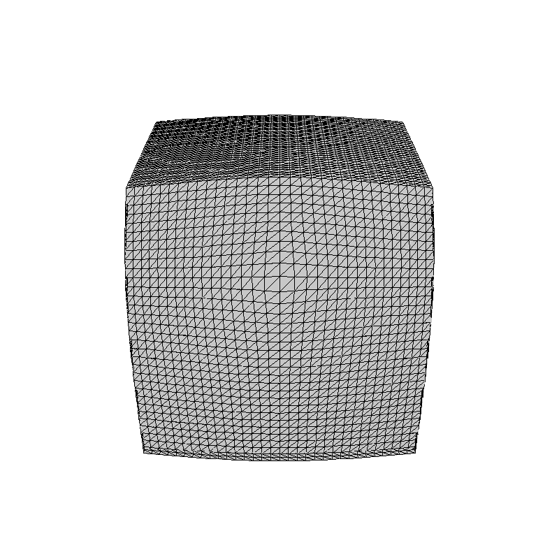

# PPM Renderer
Study project to learn the basics of computer graphics without relying on any API 

# Key updates 
[Все апдейты здесь](./CHANGELOG.md)

## 30-03-2026

## 31-03-2026
3-х точечная проекция и буфер глубины

## 14-04-2026
Оптимизации и интерфейсы
Тесселяция и "рыбий глаз"

